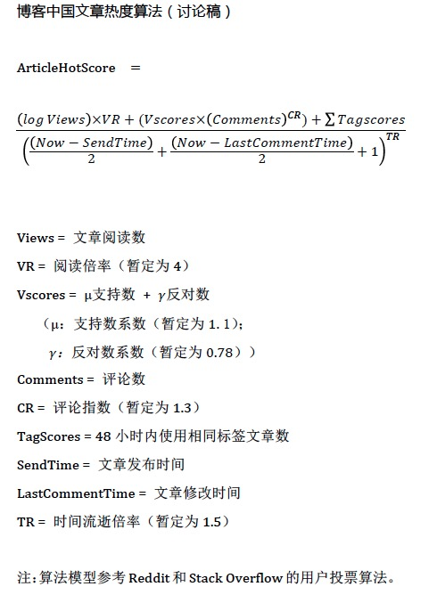

# 热度文章算法


### 算法说明


### 算法实现

```php

function getAlg($click_num,$supportnum,$opposenum,$commentnum,$createtime,$commenttime) {     
    
    $p = [
        'views'     => $click_num, //阅读数
        'vr'        => 4, //阅读倍率，暂定为4

        'supports'  => $supportnum, //支持数
        'sc'        =>1.1, //支持数系数，暂定为1.1
        'opposes'   =>$opposenum, //反对数
        'oc'        =>0.78,//反对数系数
        
        'comments'  =>$commentnum,//评论数
        'ci'        =>1.3,//评论指数，暂定为1.3

        'sendTime'  =>$createtime,//文章发表时间 10位时间戳
        'lastCommentTime'   =>$commenttime,//最后评论时间 10位时间戳
        'tr'        => 0.8, //时间流逝倍率，暂定为0.8
    ];
    $a = log($p['views']) * $p['vr'];

    $b = ($p['supports'] * $p['sc'] + $p['opposes'] * $p['oc']) * pow($p['comments'],$p['ci']);

    $c = 0;//todo tag量

    $d = pow( (time()-$p['sendTime'])/2 + (time()-$p['lastCommentTime'])/2 +1,   $p['tr']);

    $z = ($a + $b + $c) / $d;

    return $z;
}
```